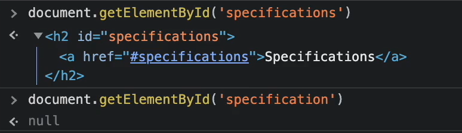
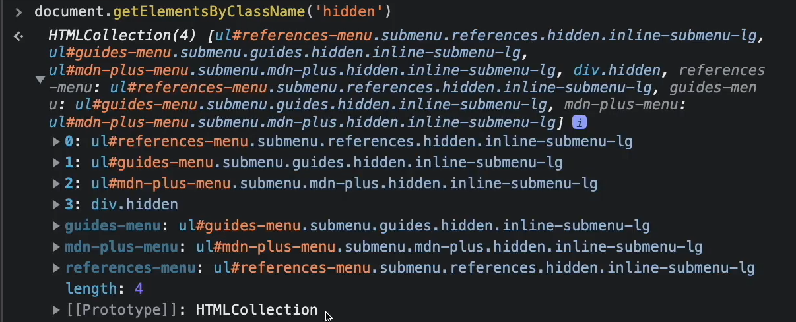
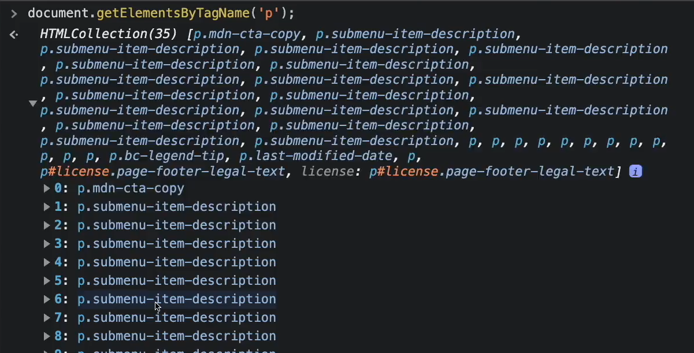
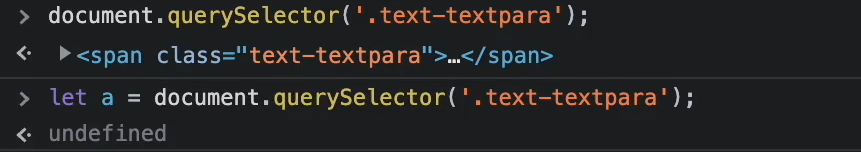
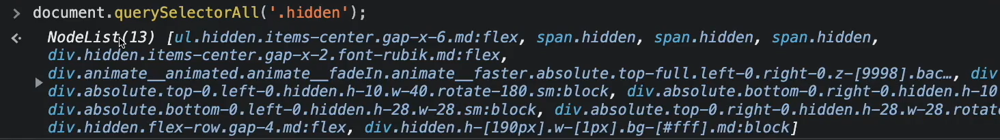

# Access(Search, Fetch, Target) HTML ELEMENT

Targeting Methods yani ki hame kisi ki value get ya set karni hoto use ham target kese kare ge
kyo ki ek page me multiple tag ho sakte hai. Iske liye hame pehle jis element ko change karna hai usse pehle get(fetch) karna pade ga. jiske liye ham Targeting Methods ka use karenge.

**5 important Targeting Methods**

Id -> document.getElementById(id) :->
getElementById(id) method hai wo hame id ka use karke element find karne me help karta hai.
yadi ussi id name se element present hoga to hame element return mile ga nahi to null mile ga.
NOTE: getElementById(id) hai wo ek object return karta hai. or ye hame only single object return karta hai.
kyo ki hame pata hai ki id hai wo unique hoti hai to hame only single object hee return me mile ga.
**Example**

Class Name -> document.getElementsByClassName(name) :->
getElementsByClassName(name) method hai wo hame class ka use karke element find karne me help karta hai.
getElementsByClassName(name) method hame page me jitne bhi element same class name se present honge wo sab ka ek HTMLCollection (array-like object similar to arguments) return kare ga.
yani ki jo getElementsByClassName(name) method hai wo hame multiple object return karta hai.
**Example**

Tag Name -> document.getElementsByTagName(name)
getElementsByTagName(name) method hai wo same getElementsByClassName(name) jesa hee work karta hai.
lekin getElementsByTagName(name) ka use karke ham tag ki help hai element ko find karte hai.
**Example**

document.querySelector() :-> document.querySelector() method ka use yadi ham kisi element ko id,class ya tag ka name use karke find(fetch) karna chahte hai tab hota hai.
document.querySelector() method hame first wala element hee return kare ga.
chahe ham class ka use kare, id ya fir tag ka lekin wo first wala element hee return kare ga.

yadi hame id ka use karke find karna hai to ham likhe ge.
document.querySelector(#id)
yadi hame tag ka use karke find karna hai to ham likhe ge.
document.querySelector(tag)

document.querySelectorAll() :-> document.querySelectorAll() method bhi same document.querySelector() jesa hee work karta hai lekin document.querySelectorAll() method hame jitne bhi element honge wo sabhi return kare ga.

Different Between querySelector & querySelectorAll
querySelector & querySelectorAll ka use target karne ke liye hota hai 
difference itna hai ki querySelector chahe uske target tag 30-40 milte hai fir bhi wo first wale ko he get/set kare ga.
jab ki querySelectorAll usse jitne bhi target tag mile ge wo un sabko get/set kare ga.

NOTE : ye 5 method ko call karne ke liye hame document object ka use karna hee pade ga.

**Sort Cut Trick To Get Element**
yadi ham kisi element ko select karke $0 likhenge to hame wo pura ka pura element mil jaaye ga.

yadi ham chahe to apne element ko kisi variable ko bhi assign kar sakte hai.

Other Targeting Methods & Properties

document
document object hai jo ki hame pura document return karta hai 

document.all
document.all hame sabhi tag return karta hai

!! yahi multiple tag ho or hame kisi ek tag ko target karna hoto ham uska index de sakte hai
ex :- document.all[6]
ese hi ham niche ke sabhi methods ke saath kar sakte hai

document.documentElement
document.head
document.head hame head ka pura section return karta hai

document.title
document.title hame title return karta hai 

document.body
document.body hame body ka pura section return karta hai

document.images
document.images hame page ke sabhi images ko return karta hai

document.anchors
document.anchors hame page ke sabhi anchors ko return karta hai

document.links
document.links hame page ke sabhi links ko return karta hai

document.forms
document.forms hame page ke sabhi forms ko return karta hai

document.doctype
document.doctype hame page ka doctype return karta hai

document.URL
document.URL hame website ka URL return karta hai (like:- https://www.abc.com/ )

document.baseURI
document.baseURI hame website ka baseURI return karta hai (like:- https://www.abc.com/ )

document.domain
document.domain hame website ka domain return karta hai (like:- abc.com)